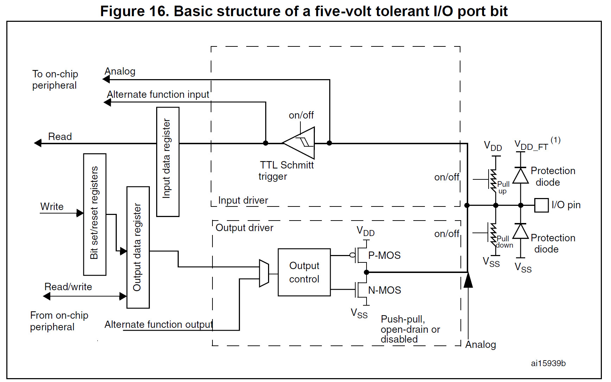
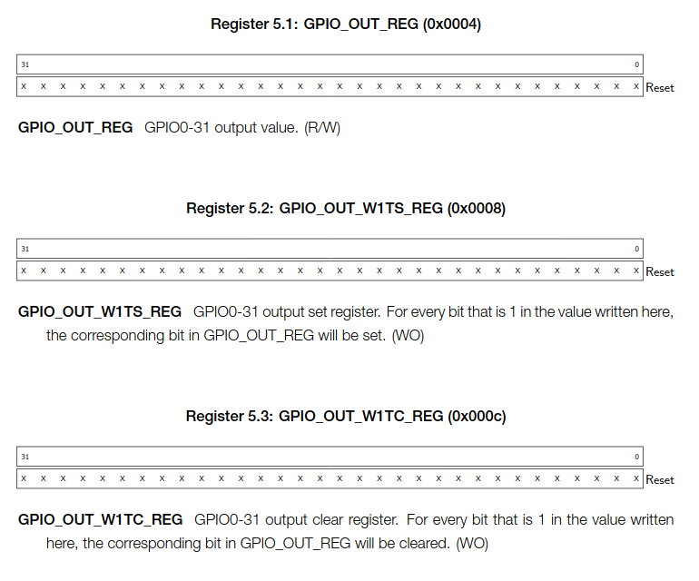

# Embedded Systems Study Group
- [Embedded Systems Study Group](#embedded-systems-study-group)
- [ADC](#adc)
- [DAC](#dac)
- [Bit manipulations](#bit-manipulations)
  - [& operator](#-operator)
  - [| operator](#-operator-1)
  - [<< operator](#-operator-2)
  - [>> operator](#blockquoteblockquoteoperatorblockquoteblockquote)
- [GPIO](#gpio)
  - [Implementation](#implementation)
  - [GPIO's on ESP32](#gpios-on-esp32)
    - [Config GPIOs](#config-gpios)
    - [Set GPIOs](#set-gpios)
    - [How are GPIO's handled internally](#how-are-gpios-handled-internally)
 
# ADC

# DAC

# Bit manipulations

## & operator

`a & b` does bitwise and of the two values

* `1 & 1 = 1`
* `1 & 0 = 0`
* `0 & 1 = 0`
* `0 & 0 = 0`

```c
#include <stdio.h>

int main()
{
    unsigned int val1 = 0x1;
    unsigned int val2 = 0x0;
    unsigned int result = val1 & val2;

    printf("decimal: %d hex: %x\n", result, result);
}
```

output: `decimal: 0 hex: 0`

## | operator

`a | b` does bitwise or of the two values

* `1 | 1 = 1`
* `1 | 0 = 1`
* `0 | 1 = 1`
* `0 | 0 = 0`

```c
#include <stdio.h>

int main()
{
    unsigned int val1 = 0x1;
    unsigned int val2 = 0x0;
    unsigned int result = val1 | val2;

    printf("decimal: %d hex: %x\n", result, result);
}
```

output: `decimal: 1 hex: 1`

## << operator

`a << b` left shifts a by b times.

if a = 00001001 and b = 2, then `a << b = 00100100`

```c
#include <stdio.h>

void print_bin(unsigned int integer)
{
    int i = 8 * sizeof(int); /* however many bits are in an integer */
    while(i--) {
        putchar('0' + ((integer >> i) & 1)); 
    }
    putchar('\n');
}

int main()
{
    unsigned int val = 0x1;

    for(int i = 0; i < 32; i++)
    {
        print_bin(val);
        val = val << 1;
    }
}
```

output:

```
00000000000000000000000000000001
00000000000000000000000000000010
00000000000000000000000000000100
00000000000000000000000000001000
00000000000000000000000000010000
00000000000000000000000000100000
00000000000000000000000001000000
00000000000000000000000010000000
00000000000000000000000100000000
00000000000000000000001000000000
00000000000000000000010000000000
00000000000000000000100000000000
00000000000000000001000000000000
00000000000000000010000000000000
00000000000000000100000000000000
00000000000000001000000000000000
00000000000000010000000000000000
00000000000000100000000000000000
00000000000001000000000000000000
00000000000010000000000000000000
00000000000100000000000000000000
00000000001000000000000000000000
00000000010000000000000000000000
00000000100000000000000000000000
00000001000000000000000000000000
00000010000000000000000000000000
00000100000000000000000000000000
00001000000000000000000000000000
00010000000000000000000000000000
00100000000000000000000000000000
01000000000000000000000000000000
10000000000000000000000000000000
```

## >> operator

`a >> b` right shifts a by b times.

if a = 00001001 and b = 2, then `a << b = 00000010`

```c
#include <stdio.h>

void print_bin(unsigned int integer)
{
    int i = 8 * sizeof(int); /* however many bits are in an integer */
    while(i--) {
        putchar('0' + ((integer >> i) & 1)); 
    }
    putchar('\n');
}

int main()
{
    unsigned int val = 0x80000000;

    for(int i = 0; i < 32; i++)
    {
        print_bin(val);
        val = val << 1;
    }
}
```

output:

```
10000000000000000000000000000000
01000000000000000000000000000000
00100000000000000000000000000000
00010000000000000000000000000000
00001000000000000000000000000000
00000100000000000000000000000000
00000010000000000000000000000000
00000001000000000000000000000000
00000000100000000000000000000000
00000000010000000000000000000000
00000000001000000000000000000000
00000000000100000000000000000000
00000000000010000000000000000000
00000000000001000000000000000000
00000000000000100000000000000000
00000000000000010000000000000000
00000000000000001000000000000000
00000000000000000100000000000000
00000000000000000010000000000000
00000000000000000001000000000000
00000000000000000000100000000000
00000000000000000000010000000000
00000000000000000000001000000000
00000000000000000000000100000000
00000000000000000000000010000000
00000000000000000000000001000000
00000000000000000000000000100000
00000000000000000000000000010000
00000000000000000000000000001000
00000000000000000000000000000100
00000000000000000000000000000010
00000000000000000000000000000001
```

# GPIO

A General Purpose Input/output (GPIO) is an interface available on most modernmicrocontrollers (MCU) to provide an ease of access to the devices internal properties.

Generally there are multiple GPIO pins on a single MCU for the use of multipleinteraction so simultaneous application. The pins can be programmed as input, wheredata from some external source is being fed into the system to be manipulated at a desiredtime and location. Output can also be performed on GPIOs.

GPIOs are used in a diverse variety of applications, limited only by the electrical and timing specifications of the GPIO interface and the ability of software to interact with GPIOs in a sufficiently timely manner. 

## Implementation

GPIO interfaces vary widely. In some cases, they are simple—a group of pins that can switch as a group to either input or output. In others, each pin can be set up to accept or source different logic voltages, with configurable drive strengths and pull ups/downs.

A GPIO pin's state may be exposed to the software developer through one of a number of different interfaces, such as a memory-mapped I/O peripheral, or through dedicated IO port instructions. 

A GPIO port is a group of GPIO pins (usually 8 GPIO pins) arranged in a group and controlled as a group.

GPIO abilities may include:

* GPIO pins can be configured to be input or output
* GPIO pins can be enabled/disabled
* Input values are readable (usually high or low)
* Output values are writable/readable
* Input values can often be used as IRQs (usually for wakeup events)



## GPIO's on ESP32

Each gpio can be controlled using register inside the ESP32, but to make our life easy espressif provides a SDK, called ESP-IDF which handles all the talking/reading from the registers and provides nice C functions to use the GPIO, following is the C code to setup GPIO on the esp32, this seems a bit complex but it isn't. `gpio_conf_t` is a struct defined in the source code, which holds all the gpio settings.

### Config GPIOs

```c
gpio_config_t io_conf;
// bit mask for the pins, each bit maps to a GPIO 
io_conf.pin_bit_mask = (1ULL<<21);

// set gpio mode to input
io_conf.mode = GPIO_MODE_INPUT;

// enable pull up resistors
io_conf.pull_up_en = 1;

// disable pull down resistors
io_conf.pull_down_en = 0;

// disable gpio interrupts
io_conf.intr_type = GPIO_INTR_DISABLE;

// detailed description can be found at https://docs.espressif.com/projects/esp-idf/en/latest/esp32/api-reference/peripherals/gpio.html#_CPPv413gpio_config_t

// configure gpio's according to the setting specified in the gpio struct
esp_err_t err = gpio_config(&io_conf);
```

This the definition of gpio struct 

```c
typedef struct {
    uint64_t pin_bit_mask;          /*!< GPIO pin: set with bit mask, each bit maps to a GPIO */
    gpio_mode_t mode;               /*!< GPIO mode: set input/output mode                     */
    gpio_pullup_t pull_up_en;       /*!< GPIO pull-up                                         */
    gpio_pulldown_t pull_down_en;   /*!< GPIO pull-down                                       */
    gpio_int_type_t intr_type;      /*!< GPIO interrupt type                                  */
} gpio_config_t;
```

This can be found in `esp/esp-idf/components/soc/include/hal/gpio_types.h`

### Set GPIOs

To set value of a gpio, we use the following function `gpio_set_level()`, so if we want to set HIGH to gpio 21, we'll do this: `gpio_set_level((gpio_num_t)21, 1)`

Internal Implementation of this function is as follows

```c
static inline void gpio_ll_set_level(gpio_dev_t *hw, gpio_num_t gpio_num, uint32_t level)
{
    if (level) {
        if (gpio_num < 32) {
            hw->out_w1ts = (1 << gpio_num);
        } else {
            hw->out1_w1ts.data = (1 << (gpio_num - 32));
        }
    } else {
        if (gpio_num < 32) {
            hw->out_w1tc = (1 << gpio_num);
        } else {
            hw->out1_w1tc.data = (1 << (gpio_num - 32));
        }
    }
}

This can be found in `esp/esp-idf/components/soc/include/hal/gpio_ll.h`

### Get GPIOs

To get value of a gpio, we use the following function `gpio_get_level()`, so if we want to get value of gpio 21, we'll do this: `gpio_get_level((gpio_num_t)21)`

static inline int gpio_ll_get_level(gpio_dev_t *hw, gpio_num_t gpio_num)
{
    if (gpio_num < 32) {
        return (hw->in >> gpio_num) & 0x1;
    } else {
        return (hw->in1.data >> (gpio_num - 32)) & 0x1;
    }
}
```

This can be found in `esp/esp-idf/components/soc/include/hal/gpio_ll.h`

### How are GPIO's handled internally

As we read earlier, these gpio's are controlled using registers. There registers have been memory mapped, so consider them as a variable pointer which can then be manipulated to set their values.

Typically when we access registers in C based on memory-mapped IO we use a pointer notation to ‘trick’ the compiler into generating the correct load/store operations at the absolute address needed.

Below is the struct used to control the gpio's, inshort this struct is used to represent the registers in our code as variables. Since a struct is stored as contagious memory location, so if we set the starting address of the this struct to that of the peripheral registers, we can use the struct to manipulate those registers.

Dealing with a memory mapped file is really no different than dealing with any other kind of pointer to memory. The memory mapped file is just a block of data that you can read and write to from any process using the same name. 

```c
struct volatile gpio_dev_t *__gpio_reg = (void*)0x3FF44000;
```

```c
typedef volatile struct gpio_dev_s {
    uint32_t bt_select;                             /*NA*/
    uint32_t out;                                   /*GPIO0~31 output value*/
    uint32_t out_w1ts;                              /*GPIO0~31 output value write 1 to set*/
    uint32_t out_w1tc;                              /*GPIO0~31 output value write 1 to clear*/

// ....
// ....
// there's more stuff here, but it is not relevant for our lecture
// ....
// ....

uint32_t in;                                    /*GPIO0~31 input value*/
union {
    struct {
        uint32_t data:       8;                 /*GPIO32~39 input value*/
        uint32_t reserved8: 24;
    };
    uint32_t val;
} in1;

// ....
// ....
// there's more stuff here, but it is not relevant for our lecture
// ....
// ....

} gpio_dev_t;
extern gpio_dev_t GPIO;
```

This can be found in `esp/esp-idf/components/soc/soc/esp32/include/soc/gpio_struct.h`





[led blink using struct register access](../assets/week5/esp-gpio-example-output.zip)
[button input using struct register access](../assets/week5/esp-gpio-example-input.zip)
[led blink using direct memory access](../assets/week5/esp-gpio-output-direct-memory-access.zip)
[button input using direct memory access](../assets/week5/esp-gpio-input-direct-memory-access.zip)

